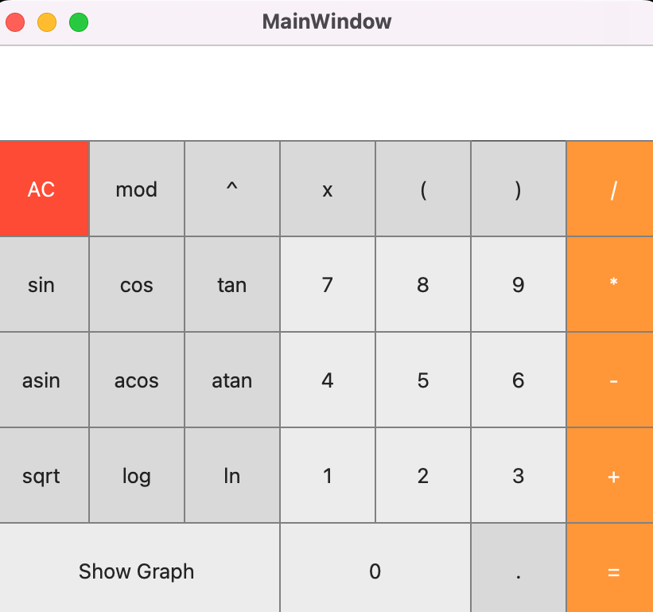
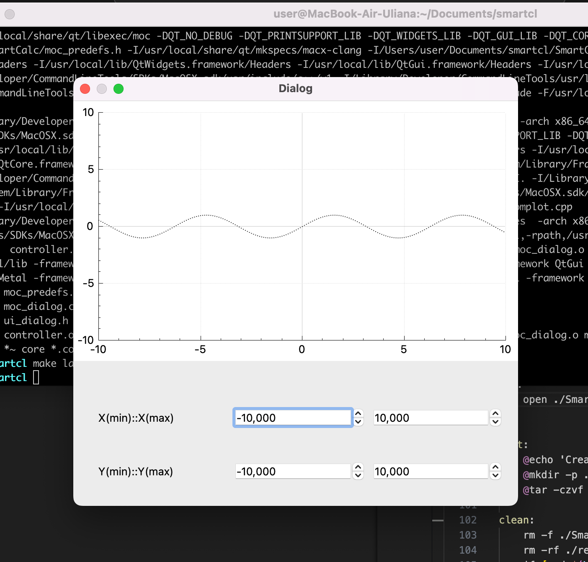

# SmartCalc

## Арифметический калькулятор

Арифметический калькулятор представляет собой расширенный набор операций и функций для математических и инженерных расчетов. 

Этот режим позволяет наглядно видеть полное введенное выражение, контролирует правильность ввода через интерфейс, а так же дает возможность ручного ввода.  Для выражений с переменной **х** при нажатии на ********=******** выводит график. Предусмотрена настройка графика.

